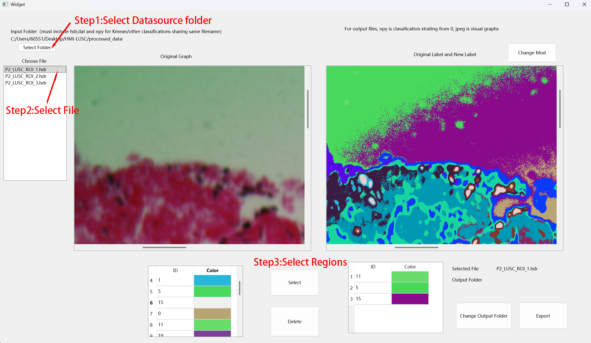
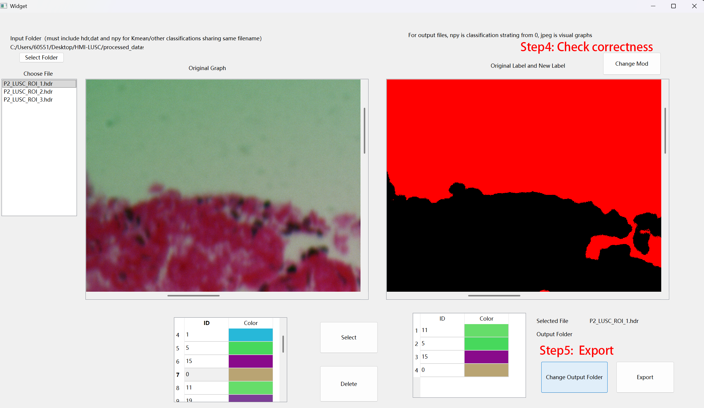

# **HMI-LUSC: A Histological Hyperspectral Imaging Dataset for Lung Squamous Cell Carcinoma**

**HMI-LUSC** is the first publicly available hyperspectral microscopic imaging (HMI) dataset dedicated to lung squamous cell carcinoma (LUSC). It contains **62 hyperspectral images** from 10 patients, acquired with a spatial resolution of **3088 x 2064 pixels** and a spectral resolution of **450-750 nm (61 bands)**.

The dataset includes physician-annotated tumor regions and refined cell-level labels generated via a semi-automated workflow. This repository contains the official implementation of the data processing, label refinement, and tumor detection pipeline described in our paper.


Final Label Definitions:  
| ID | Class | Color in Mask | Description |  
| :--- | :--- | :--- | :--- |  
| 0 | Non-Cell | Black | Stroma, extracellular material |  
| 1 | Non-Tumor Cell | Red | Normal epithelium, lymphocytes |  
| 2 | Tumor Cell | Green | Malignant squamous cells |  
| 3 | Background | Blue | No tissue present |


**Dataset Download:** The full dataset is available on Figshare: [https://doi.org/10.6084/m9.figshare.30188080.v1](https://doi.org/10.6084/m9.figshare.30188080.v1)

### **⚠️ Important Terminology Note**

To maintain compatibility with the codebase variables, please note the following terminology mapping:

* **ill** in the code refers to **Tumor** regions (Pathological "Illness").  
* **non-ill** in the code refers to **Non-Tumor** regions (Normal/Healthy tissue).

## **🛠️ Environment Requirements**

The project requires Python 3.8+ and the following key libraries:

* **Core:** numpy, matplotlib, cv2 (opencv-python), scikit-learn, yaml  
* **Hyperspectral Processing:** spectral  
* **Deep Learning:** torch (PyTorch)  
* **GUI Tools:** PySide6 (Required for the Label Refinement tool)  
* **Optional (GPU ML):** cuml, cupy (For GPU-accelerated Random Forest/SVM). The installation could be difficult and we suggest using conda to create a new environment for it by following [RAPIDS INSTALLATION](https://docs.rapids.ai/install/). The lack of cuml will cause SVM unable to run, therefore we disable SVM by default.

Assume you have pytorch and python available and wish to use pip for automatic package installation based on your current environments. Install dependencies via pip:

```python
pip install -r requirements.txt
```

## **📂 Project Structure**

This repository is organized into three main components:

1. **DataPreparation/**: Scripts for flat-field calibration, spectral smoothing, and normalization.
2. **CustomLabelGeneration/**: A semi-automated workflow (K-Means + GUI) to refine coarse annotations into pixel-wise cell-level labels.
3. **SampleTraining/**: Implementation of Machine Learning (RF, SVM) and Deep Learning (CNN2D, CNN3D, HybridSN) models for tumor segmentation. Pretrained models are provided except for the SVM (cuml version), which exceeds the 100MB file size supported on GitHub. HybridSN is optional as a substitute for advanced models.

## **🚀 Usage Guide**

### 1. Data Preparation

Convert raw HSI data into deep-learning-ready formats. This step performs flat-field calibration (Equation 1 in the paper), spectral smoothing, and normalization. Users can explore various preprocess configurations and see the result via ENVI software. Default values are selected on experiments basis.

* **Script:** DataPreparation/preprocess.py  
* **Key Parameters:**  
  * DATA\_SOURCE\_FOLDER: Path to the downloaded raw dataset (P1, P2...).  
  * OUTPUT\_FOLDER: Destination for processed datacubes, default value is "./processed_dataset".  
  * PERCENT\_LINEAR\_VALUE: Linear stretch percentile for visualization (default: 0).
  * SNV_USED: Whether using standard normal variation, which is basically Z-score normalization (default: 1 use).
  * PERBAND: Whether the normalization is done for each bands or the whole datacube (default: 0 not use).
  * OPTLIN: Whether use optimized linear stretching (default 1 use).
  
**Run:**
```python
cd DataPreparation  
python preprocess.py
```

**Output:** 
The output folder would contain the following subfolders:
- cell_labels, cell-level labels, where 0,1,2,3 are corresponding to non-cell(black), nonill-cell(red), ill cell(green) and background(blue) region. You can consider it as instance segmantation for cell.
- datacubes, preprocessed hyperspectral datacubes.
- labels, coarse labels originally provided by pathologists, where 0 indicating non-ill and 1 indicating ill.
- rgbs, mainly used for visual check and neccessary for cell-level label generation interface we designed


### 2. Label Refinement

Generate granular cell-level labels from coarse pathologist annotations.

#### 2.1: K-Means Clustering

Use script in preprocess/Kmean-classification.py to automatically generate classification of each hyperspectral file in the input folder.
- KMEAN_NUM, total classification numbers which is 20 by default. The values are chosen based on the tradeoff between classifications details and manual selection difficulties.
- input_dir, folder contain hdr and dat files for hyperspectral images.
- output_dir, output folder contain classification labels, for easier use of manual label selection, same as input_dir by default.


```python
python CustomLabelGeneration/Kmean-classification.py
```
#### 2.2: Manual Refinement (GUI)

Run preprocess/QtLabel/widget.py to use the manual label selection user interface. Instructions are already in the interface. There are several suggestions for easier usage.

- The input folder must contain hdr and dat files for hyperspectral images, and the classifications labels created earlier.
- We select cells and background separately. When you output the file, please put them into a separate output folder and name accordingly.
- Use the change mask button to switch between the classification labels and the selected labels. This allows you to check whether the selected regions satisfy your need.
- Images below show examples of selecting some background regions for P2-1.


```python
python CustomLabelGeneration/QtLabel/widget.py
```
In the future we plan to further polish this user interface such that we can choose based on mouse selected points rather than visually find the corresponding regions. This should significantly accelerate the selection speed and ahcieve quick semi-automatic labels selection.




#### 2.3: Label Fusion

Once you obtain the cell and background labels, together with the tumor label provided by physicians, you can create the four types label used in training.

You should have 3 input folders ready
- coarse labels folder, indicating whether regions are ill or non-ill, which is provided by the original dataset and can be found in the output folder of 2. Preprocessing.
- cell folder, indicating which regions belong to cells, provided by 3.2 QtLabels generation
- background folder, indicating what areas are background, selected due to background noise is very large, provided by 3.2 Qtlabels generation or other region selection softwares.

When three folders can prepared, you can run ./CustomLabelGeneration/label_generation.py to obtain the four class labels. We have provided ./CustomLabelGeneration/label_generation_sample folder as sample labels for testing. These data come from the actual labels we have used in real experiments and full data can be obtained by request.

```python
python CustomLabelGeneration/label_generator.py
```


### 3: Tumor Detection Network

To this point, you should have accessed to all required data and labels for tumor detection deep learning.

#### 3.1: Usage instruction
In this experiment we use patch level diagonosis to perform pixel-level segmentation. In other word, we will extract a small patch from one pixel as one sample data and let the pixel label as the patch label. We will extract patches from all available data in the training set on a balanced types basis, where the ratio for 0123 is 2:1.5:0.5:1. The variable patch_stride is a deprecated variable and no longer effective.

To train your own models, adjust files in SampleTraining/configs and run preprocess.py, train.py, test.py and prediction.py sequentially, you can also directly run the simple shell file (Linux environment)

```python
python preprocess.py
python train.py
python test.py
python prediction.py
```

```python
sh run.sh
```

We have also provided pretrained model parameters for quick test. In that case you can run test.py and prediction.py sequentially for test purpose. Please modify the folder path in that case. 

#### 3.2: Configuration Parameters
Below are detailed explanations for the configuration files found in SampleTraining/configs/, which control data preparation, model training, and testing.

##### 3.2.1: Preprocessing Configuration (configs/preprocess.yml)
Used by preprocess.py to prepare training data (patches) from the full datacubes.
- data: Input path to the folder containing preprocessed datacubes (generated in Step 2).
- label: Input path to the folder containing cell-level labels.
- output: Output destination for the generated network input data (patches/samples).
- test_ratio: The fraction of data reserved for testing (e.g., 0.01 for 1%, not effective actually since the training and test images are split by hand in our experiment).
- patch_size: The spatial dimension of the input patches (e.g., 25 for a 25x25 pixel patch).
- pca_components: Number of spectral components to retain after PCA reduction (e.g., 30).
- patch_stride: Stride used when extracting patches (Note: this variable is deprecated in current version, we use random 2:1.5:0.5:1 ratio now).

##### 3.2.2: Training Configuration (configs/train.yml)
Used by train.py to train the selected models.
- input: Path to the network input data generated by preprocess.py.
- parameter_dir: Directory where trained model parameters/weights will be saved.
- cupy: 1 to enable CuPy for GPU acceleration (if supported by the model), 0 to disable.
- train_models: A list of flags to enable (1) or disable (0) specific models for training:
- CNN3D / CNN2D: Standard CNN architectures.
- RF: Random Forest.
- RBF_SVM: Support Vector Machine with RBF kernel.
- params: Hyperparameters for specific models:

##### 3.2.3: Testing Configuration (configs/test.yml)
Used by test.py to run inference and generate probability maps.
- input_dir: Path to the source datacubes for inference.
- label_dir: Path to the ground truth labels (for metric calculation).
- prediction_dir: Output folder where generated probability maps (.npy files) will be saved.
- parameter_dir: Path where the trained model weights are stored (should match train.yml).
- pca_components & patch_size: Must match the values used during training/preprocessing.
- test_num: The number of samples/images to process during testing.
- test_models: Configuration for each model during the test phase:
- param: The specific filename of the trained weight file (e.g., hybrid_BN_A.pth).
- net: 1 to build/load the network architecture structure, please do not modify it.
- test: 1 to perform inference with this model, 0 to skip.

##### 3.2.4: Prediction
Use prediction.py to generate final segmentation maps from the probability outputs of test.py and calculate performance metrics. Note: Configuration is done by editing the global variables at the top of the script, not via a YAML file.

- TEST_OUTPUT_ROOT: The root directory containing the probability output folders generated by test.py.
- GT_LABEL_DIR: Directory containing the ground truth labels with 4 classes, including a performance statistics file in csv.
- FINAL_OUTPUT_ROOT: Output directory where final colored segmentation images (.tif), label arrays (.npy), and the performance report will be saved.
- MODELS_TO_PROCESS: A list of model names (strings) to process, such as CNN3D and CNN2D. These must match the folder names created in TEST_OUTPUT_ROOT.

## **📄 Citation**

If you use **HMI-LUSC** or this code in your research, please cite our paper:

@article{yan2025HMI,  
  title \= {HMI-LUSC: A Histological Hyperspectral Imaging Dataset for Lung Squamous Cell Carcinoma},  
  author \= {Zhiliang Yan and Haosong Huang and Ye Guo and Jintao Shi and Rongmei Geng and Jingang Zhang and Yu Chen and Yunfeng Nie},  
  journal \= {Scientific Data},  
  year \= {2025},  
  note \= {Under Review}  
}  

## Contact 
If the dataset can no longer be accessed, codes cannot be run or other things raise your concern, please raise Issues or contact hhuang2@stu.xidian.edu.cn (available before May 2028). We may simplify and update codes in future.
